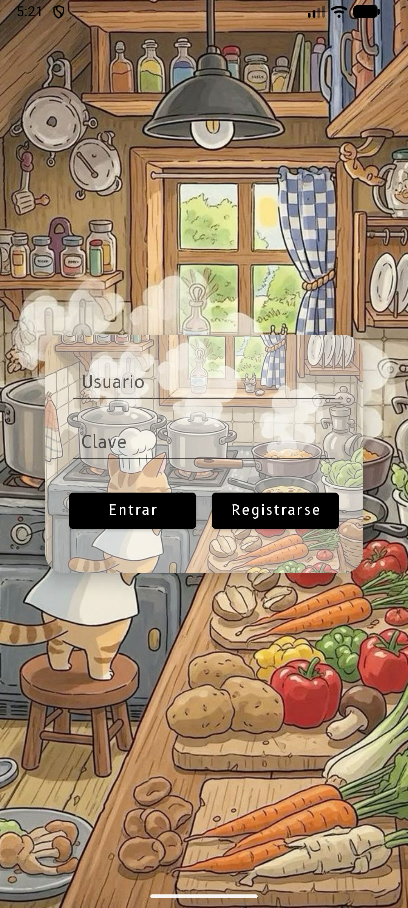
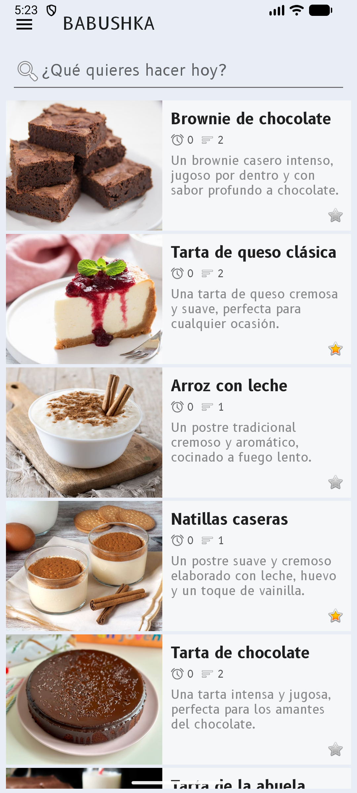
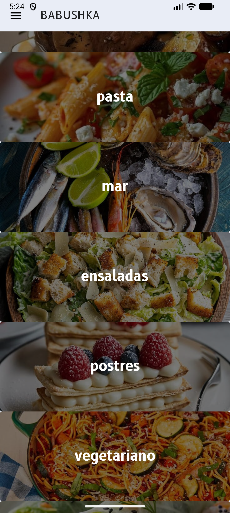
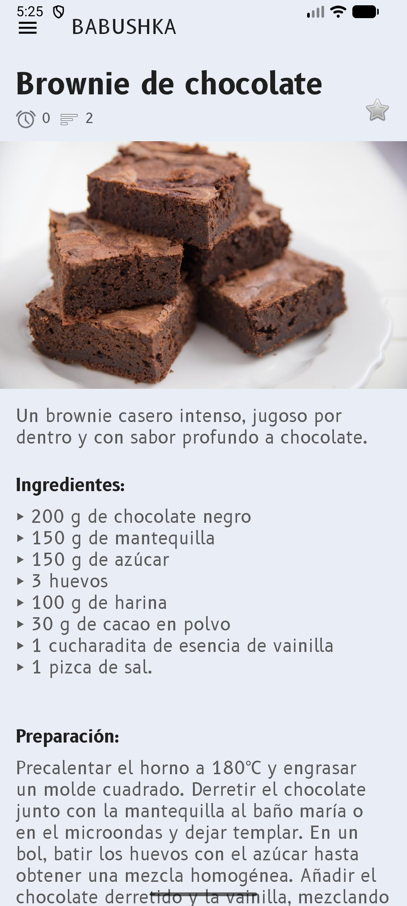
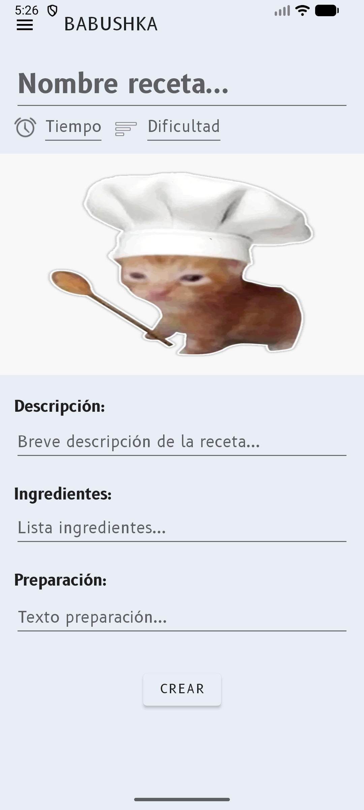
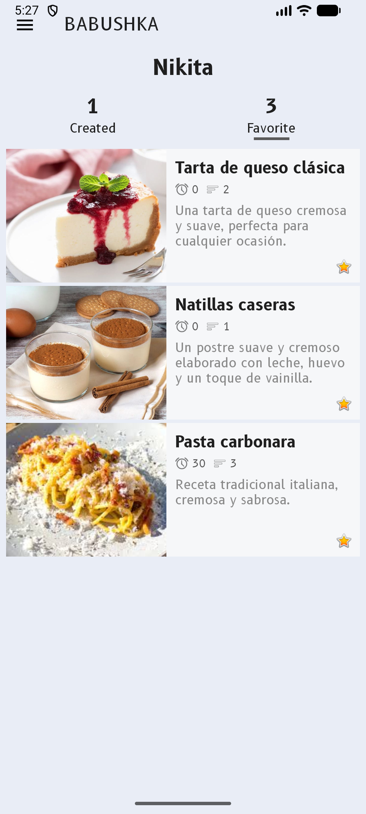

# Babushka

**Babushka** is a recipe-sharing application created by four students as a study project. The idea is simple: users can create recipes, browse recipes from other users, save favorites, and organize recipes by categories.

The project is split into three parts:

- **Babushka Android**: the mobile app used by users.
- **Babushka Django**: the active backend API used by the Android app.
- **Babushka Spring**: the first backend version, kept as a legacy project after the backend was moved to Django.

# Babushka Android

Babushka Android is the mobile client for the recipe application. It lets users register, log in, browse recipes, filter recipes by category, open recipe details, create new recipes, and manage their own recipes and favorite recipes from the profile screen.

The app is connected to the active Django backend through Retrofit. It stores the session token locally, sends it with protected requests, loads recipe and category images from the server, and keeps favorite state synchronized with the backend.

## Project Pair

- [**Babushka Android**](https://github.com/Babushka-dev/Babushka-Android): the mobile app in this repository.
- [**Babushka Django**](https://github.com/Babushka-dev/Babushka-Django): the active backend REST API used by the Android app.
- [**Babushka Spring**](https://github.com/Babushka-dev/Babushka-Spring): the old backend prototype, kept for reference.

By default, the app connects to the local Django backend at:

```text
http://10.0.2.2:8000/
```

This address is used by the Android emulator to reach a Django server running on the development machine.

## Screenshots

The images below are placeholders for project screenshots. Create these screenshots and place them in `docs/images/` with the same file names.

<table>
  <tr>
    <td></td>
    <td></td>
    <td></td>
  </tr>
  <tr>
    <td></td>
    <td></td>
    <td></td>
  </tr>
</table>

## Features

- User registration and login.
- Session token storage.
- Automatic `Authorization: Bearer <token>` header for protected requests.
- Recipe feed with pagination support.
- Recipe search by title.
- Recipe filtering by category.
- Server-loaded recipe images.
- Server-loaded category images.
- Recipe details screen.
- Recipe creation with title, description, ingredients, preparation, time, difficulty, and optional image.
- Favorite and unfavorite actions.
- Profile information with created and favorite recipe counts.
- Lists of recipes created by the current user.
- Lists of recipes saved as favorites by the current user.
- Drawer navigation between the main app sections.

## Tech Stack

- Java 11 source compatibility.
- Android SDK 36.
- Minimum SDK 28.
- AndroidX AppCompat.
- Material Components.
- ConstraintLayout.
- Retrofit 3.
- Gson converter.
- OkHttp logging interceptor.
- Gradle Kotlin DSL.

## How It Works

1. The user creates an account or signs in.
2. The Django backend returns a session token.
3. The Android app stores the token locally.
4. Protected requests are sent with the `Authorization: Bearer <token>` header.
5. The user can browse recipes, search recipes, filter by category, open recipe details, create recipes, and manage favorites.
6. Images are loaded from backend image endpoints as binary JPEG responses.

## Running Locally

1. Start the [Babushka Django](https://github.com/Babushka-dev/Babushka-Django) backend.
2. Open `Babushka-Android/` in Android Studio.
3. Build and run the app on an emulator or Android device.
4. If you use an emulator, keep the default backend URL:

```text
http://10.0.2.2:8000/
```

For a physical Android device, replace the base URL in `RetrofitClient.java` with the development machine IP address reachable from the device.
